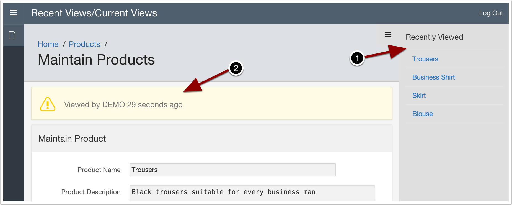
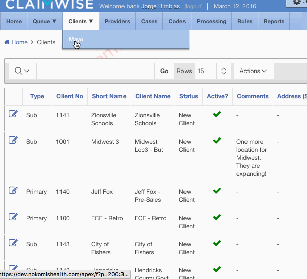

# Recent Page Views

## What is this?
The Recent Page Views module offers two features for your Oracle APEX applications:

* Keep track of the most recent pages an application user has viewed.
* Implement a User Viewing/Editing Warning (simplified record lock) notification.



### Recent Pages
Use this functionality to track the most recent pages and entities that user's view. Entities can be APEX pages or optionally an APEX page that edits/displays a particular record of data via a Primary Key.

The code tracks the most recent pages that have been viewed by a user. By default, 10 elements are tracked. However, an override value can be specified per user with an APEX Preference named `TK_RECENT_PAGE_VIEWS`. Using this code:

```
apex_util.set_preference('TK_RECENT_PAGE_VIEWS', new_value);
```

Elements tracked implement a window or queue of the most recent elements. When the queue is full, and a new item is added, the oldest item will drop from the list.

When an item on the list is viewed again, it will jump to the top of the list again.

### Viewing/Editing Warning
This, easy to use feature, provides users the knowledge that someone else is already viewing the same record they just visited.

If someone has visited an _entity_ within the last 3 min (configurable in the code), the next user that visits the same entity will see a warning "Viewed by :APP_USER within X time ago."

*Important:* View the "Config" section below.

## Demo
The included app uses the "Sample Application" table DEMO_PRODUCT_INFO and illustrates typical use.

[Run Demo Here](https://apex.oracle.com/pls/apex/f?p=51769)


## Config

In order for the "Viewing/Editing Warning" functionality to work correctly you will need to configure and change `tk_recent_views_api.page_in_current_view` to indicate the pages you want warnings for.

The `c_interval` constant determines the duration used to give a user a warning that someone else is still "viewing" a record.

## Install

Simply execute the "install.sql" script.


## Real Life Examples

### Navigation Menu
See how to use Recently Viewed list for menu navigation.
This is an example of how the Recently Viewed list could be utilized for enhancing menu navigation.



The menu/tabs on that application are rendered by a list. Here's the full SQL for that list and the helper view:

```sql
select lvl
     , label_value
     , apex_util.prepare_url('f?p=' || :APP_ID || ':' || page_id || ':' || :APP_SESSION || ':' || request || ':' || :DEBUG || ':' || clear_url || ':' || params) target
     , is_current
     , image, image_att, image_alt_attr
     , a1
from (
select lvl
     , label_value
     , page_id
     , clear_url
     , request
     , params
     , is_current
     , image, image_att, image_alt_attr
     , a1
     , seq
     , viewed_on
from cw_main_tabs_v
)
order by seq, viewed_on desc, lvl
```


```sql
create or replace view cw_main_tabs_v
as
with p as (select v('APP_ID') application_id, v('APP_PAGE_ID') app_page_id, v('APP_USER') app_user from dual)
select 1 lvl
     , 'Home' label_value
     , 1 page_id
     , '' clear_url
     , '' request
     , '' params
     , case when p.app_page_id < 200 then 'YES' else 'NO' end is_current
     , '' image, null image_att, null image_alt_attr
     , 'navhome' a1
     , '0' seq
     , to_date(null) viewed_on
from dual, p
union all
select 1 lvl
     , 'Clients' label_value
     , 300 page_id
     , '' clear_url
     , '' request
     , '' params
     , case when p.app_page_id >= 300 and p.app_page_id < 360 then 'YES' else 'NO' end is_current
     , null, null, null
     , 'navclients' a1
     , '3' seq
     , to_date(null)
from dual, p
union all
select 2 lvl
     , c.client_short_name label_value
     , 310 page_id
     , '310' clear_url
     , '' request
     , 'P310_ID,P310_CALLING_PAGE:' || r.entity_id || ',' || p.app_page_id params
     , 'NO', null, null, null
     , '' a1
     , '3a'
     , r.viewed_on
from cw_recent_views r
   , cw_clients_v c
   , p
where r.page_id = 310
  and r.view_user = p.app_user
  and r.entity_id = c.client_id
union all
select 1 lvl
     , 'Reports' label_value
     , 1000 page_id
     , '' clear_url
     , '' request
     , '' params
     , case when p.app_page_id >= 1000 and p.app_page_id < 2000 then 'YES' else 'NO' end is_current
     , null, null, null
     , 'navrep' a1
     , 'R' seq
     , to_date(null)
from dual, p
union all
select 2 lvl
     , page.page_title label_value
     , r.page_id page_id
     , '' clear_url
     , '' request
     , case when r.page_id in (1060, 1080)
         then 'P' || r.page_id || '_CALLING_PAGE:' || p.app_page_id
       else
         ''
       end params
     , 'NO', null, null, null
     , '' a1
     , 'Ra'
     , r.viewed_on
from cw_recent_views r
   , apex_application_pages page
   , p
where page.application_id = p.application_id
  and page.page_id = r.page_id
  and r.page_id between 1001 and 4999
  and r.view_user = p.app_user
/
```

* Notice how the application pages are organized by ranges to facilitate the conditions.
* See the full code/view here [Full view](sample/menu_navigation_sample.sql).


## Usage
Add a "Before Header" process "Add to Recent Views (touch)" that calls `tk_recent_views_api.touch`

```
tk_recent_views_api.touch(:APP_PAGE_ID, :Pnnn_ID);
```

Where `Pnnn_ID` is the Primary Key of the record being edited.

If the page doesn't edit an entity call the `touch` procedure with the page ID only. Like so:

```
tk_recent_views_api.touch(:APP_PAGE_ID);
```

Here is an example of how you may use the recently used entries:

```
select p.product_name
from tk_recent_views r
   , demo_product_info p
where r.page_id = 15
  and r.view_user = :APP_USER
  and r.entity_id = p.product_id
order by viewed_on desc
```

### Using the User Viewing/Editing Warning (simplified record lock)

This is the region that will display the information of the user viewing or editing a record. It's meant to be shown as an alert box that lets a user know that someone just viewed the same record as they did.

In the Global Page (or a Specific Page) create a region with the following details.

Region name: User Viewing/Editing Warning

Type: PL/SQL Dynamic Content

Code:
```
begin
  for u in (select view_user, viewed_on
              from tk_current_views
             where page_id = :APP_PAGE_ID
               and entity_id = tk_recent_views_api.g_entity_pk)
  loop
    htp.p('Viewed by ' || u.view_user || ' ' || apex_util.get_since(u.viewed_on) );
  end loop;
end;
```

Condition Type: PL/SQL Function Body

PL/SQL Function Body:
```
return :APP_USER <> tk_recent_views_api.g_user and tk_recent_views_api.page_in_current_view(:APP_PAGE_ID);
```

Region Position 04 may work for Theme 26.

Set the region template as appropriate, like "Alert" for the Universal Theme or use the template below (suitable for Theme 26):

```
<div class="warning-message #REGION_CSS_CLASSES#" id="#REGION_STATIC_ID#" #REGION_ATTRIBUTES#>
  <i class="fa fa-warning fa-2x"></i> <span>#BODY#</span>
</div>
```

Optionally set the Static ID `currentViewWarning`

```
#currentViewWarning {
width: 305px;
position: absolute;
top: 0px;
right: 250px;  
}
#currentViewWarning.warning-message > span {margin-top: 4px;}
.warning-message {
    background: none repeat scroll 0 0 #FFFFCC;
    border: 1px solid #FFD700;
    box-shadow: 1px 1px 1px #AAAAAA;
    color: #848447;
    font-size: 11px;
    font-weight: bold;
    margin: 4px auto;
    padding: 5px 5px 5px 20px;
    text-align: left;
    vertical-align: top;
    width: 540px;
}
.warning-message > .fa-warning {
  padding-right: 5px;
  color: #CC8024;
  vertical-align: top;
}
.warning-color {
  color: #CC8024;
}
.warning-message > span {display: inline-block;}

```

## Dependencies
None outside the library.

## Limitations
All entities are expected to use single PK record


## Supported APEX Versions
* APEX 5.0 and above due to `sys_context('APEX$SESSION','APP_USER')`

